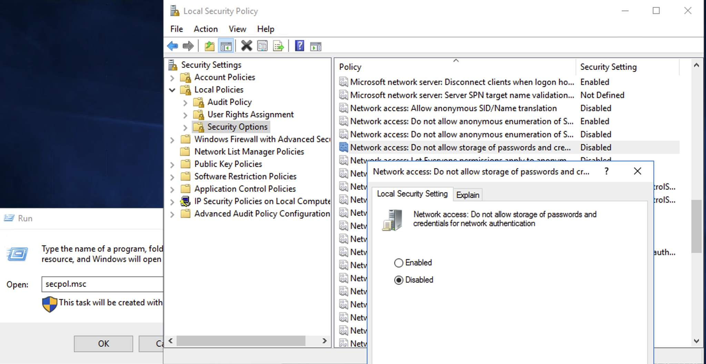

# Arc for VMWare Batch enablement

This PowerShell script, [`arcvmware-batch-enablement.ps1`](./arcvmware-batch-enablement.ps1), is designed to enable Virtual Machines (VMs) in a vCenter in batch. It's particularly useful for large-scale operations where you need to manage hundreds or thousands of VMs.
The script can be run on PowerShell (Windows) or PowerShell Core (Windows, Linux, macOS).

## Behind HTTP Proxy

If you are behind an HTTP proxy, you can run the script [`ps-http-proxy.ps1`](./ps-http-proxy.ps1) to set the proxy environment for the current PowerShell window.

## CLI parameters

You can get help on the various paramaters, their usage, and examples by running the following command:

```powershell
Get-Help .\arcvmware-batch-enablement.ps1 -Detailed
```

## Step 1

> [!NOTE]
> If all the VMs in your vCenter use the same user account, you can skip **Step 1** and **Step 2** and directly run the script in **Step 3** with the `-UseDiscoveredInventory` switch.
> `./arcvmware-batch-enablement.ps1 -VCenterId /subscriptions/12345678-1234-1234-1234-1234567890ab/resourceGroups/contoso-rg/providers/Microsoft.ConnectedVMwarevSphere/vcenters/contoso-vcenter -EnableGuestManagement -UseDiscoveredInventory`

If you have multiple set of user accounts for the VMs, you need to split your inventory into different groups. For each group, we use a single user account to install guest agent on the VMs.
To generate the inventory of VMs, you can run the script without any `-VMInventoryFile` parameter. The script will generate the inventory by running Azure Resource Graph (ARG) query.

```powershell
./arcvmware-batch-enablement.ps1 -VCenterId /subscriptions/12345678-1234-1234-1234-1234567890ab/resourceGroups/contoso-rg/providers/Microsoft.ConnectedVMwarevSphere/vcenters/contoso-vcenter -EnableGuestManagement
```

<details>
    <summary>Click to view a sample VM inventory entry generated using ARG</summary>

<table>
    <tr>
        <td>azureEnabled</td>
        <td>Yes</td>
    </tr>
    <tr>
        <td>cluster</td>
        <td></td>
    </tr>
    <tr>
        <td>guestAgentEnabled</td>
        <td>No</td>
    </tr>
    <tr>
        <td>host</td>
        <td>contoso-host</td>
    </tr>
    <tr>
        <td>id</td>
        <td>/subscriptions/12345678-1234-1234-1234-1234567890ab/resourceGroups/contoso-rg/providers/Microsoft.ConnectedVMwarevSphere/VCenters/contoso-vcenter/InventoryItems/vm-100</td>
    </tr>
    <tr>
        <td>inventoryType</td>
        <td>VirtualMachine</td>
    </tr>
    <tr>
        <td>ipAddresses</td>
        <td>[&quot;172.16.2.30&quot;]</td>
    </tr>
    <tr>
        <td>managedResourceId</td>
        <td>/subscriptions/12345678-1234-1234-1234-1234567890ab/resourceGroups/contoso-rg/providers/microsoft.hybridcompute/machines/dc0-h0-vm15/providers/microsoft.connectedvmwarevsphere/virtualmachineinstances/default</td>
    </tr>
    <tr>
        <td>moName</td>
        <td>DC0_H0_VM15</td>
    </tr>
    <tr>
        <td>moRefId</td>
        <td>vm-100</td>
    </tr>
    <tr>
        <td>osName</td>
        <td>otherGuest</td>
    </tr>
    <tr>
        <td>powerState</td>
        <td>poweredon</td>
    </tr>
    <tr>
        <td>resourceGroup</td>
        <td>contoso-rg</td>
    </tr>
    <tr>
        <td>resourcePool</td>
        <td>contoso-respool</td>
    </tr>
    <tr>
        <td>toolsRunningStatus</td>
        <td>Running</td>
    </tr>
    <tr>
        <td>toolsSummary</td>
        <td>Running, Version: 11297, (Upgrade available)</td>
    </tr>
    <tr>
        <td>toolsVersion</td>
        <td>11297</td>
    </tr>
    <tr>
        <td>toolsVersionStatus</td>
        <td>Upgrade available</td>
    </tr>
    <tr>
        <td>virtualHardwareManagement</td>
        <td>Enabled</td>
    </tr>
    <tr>
        <td>vmName</td>
        <td>DC0_H0_VM15</td>
    </tr>
</table>

</details>

<br/>

> [!NOTE]
> If you want to extract and filter using some VM properties which are visible in the vCenter, but not available in Azure, you can use `PowerCLI` or `govc` to fetch the data directly using VMWare VSphere APIs. Run the script [`powercli-export-vms.ps1`](./powercli-export-vms.ps1) to export the VM data from vCenter.

```powershell
.\powercli-export-vms.ps1 -vCenterAddress vcenter.contoso.com
```

<details>
    <summary>Click to view a sample VM inventory entry generated using PowerCLI or govc</summary>

<table>
    <tr>
        <td>vmName</td>
        <td>DC0_H0_VM15</td>
    </tr>
    <tr>
        <td>moRefId</td>
        <td>vm-100</td>
    </tr>
    <tr>
        <td>connectionState</td>
        <td>connected</td>
    </tr>
    <tr>
        <td>guestId</td>
        <td>windows2019srvNext_64Guest</td>
    </tr>
    <tr>
        <td>guestFamily</td>
        <td>windowsGuest</td>
    </tr>
    <tr>
        <td>guestFullName</td>
        <td>Microsoft Windows Server 2022 (64-bit)</td>
    </tr>
    <tr>
        <td>hostName</td>
        <td>WIN-CONTOSO</td>
    </tr>
    <tr>
        <td>powerState</td>
        <td>poweredOn</td>
    </tr>
    <tr>
        <td>toolsVersion</td>
        <td>12352</td>
    </tr>
    <tr>
        <td>toolsVersionStatus</td>
        <td>guestToolsSupportedOld</td>
    </tr>
    <tr>
        <td>toolsRunningStatus</td>
        <td>guestToolsRunning</td>
    </tr>
</table>

</details>

## Step 2

The exported inventory VM data (CSV or JSON) can be filtered and split into multiple files as per the requirement. For each file, we'll use a single user account to enable the VMs to Arc in **Step 3**. So, if you are using different user accounts, you can split the file into multiple files.

## Step 3

Before proceeding, please do the following:

- [Install `azure-cli`](https://docs.microsoft.com/en-us/cli/azure/install-azure-cli). On windows, install the 64-bit MSI version. You can skip this step if you already have `azure-cli` installed.
- Install `connectedvmware` and `resource-graph` extensions for `azure-cli` by running the following command, else the script will install it for you:
    ```bash
    az extension add --name connectedvmware
    az extension add --name resource-graph
    ```
- Login to Azure using `az login`

Run the script [arcvmware-batch-enablement.ps1](./arcvmware-batch-enablement.ps1) to enable the VMs to Arc.
First, you can run it in default mode to check the summary of the azure operations that will be performed. If you are satisfied with the summary, you can re-run the script with the `-Execute` switch to perform the azure operations.

> [!IMPORTANT]
> 1. The VMInventoryFile needs to have at least the following columns:
>   - vmName
>   - moRefId
> 2. By default, we run in dry-run mode. To execute the operations, you need to run the script with the `-Execute` switch.
> 3. If Guest management is enabled, the script with create the following files in the script's directory:
>   - `.do-not-reveal-guestvm-credential.json`: This is the ARM template parameter file that contains the credentials for the VMs. Please do not share this file with anyone.
>   - `.do-not-reveal-vm-credentials.xml`: The PSCredential object VMCredential is exported as XML to this file. Please do not share this file with anyone. The creds from this file are re-used if `-UseSavedCredentials` is passed in the subsequent runs. This is useful while using the script as a cron job.


```powershell
./arcvmware-batch-enablement.ps1 -VCenterId /subscriptions/12345678-1234-1234-1234-1234567890ab/resourceGroups/contoso-rg/providers/Microsoft.ConnectedVMwarevSphere/vcenters/contoso-vcenter -EnableGuestManagement -VMInventoryFile vms.json
```

## Batch Runner

If you have multiple different vCenters, or you want to run with multiple different parameters for different groups of VMs, you can use a script similar to the [batch-runner.ps1](./batch-runner.ps1) script.

If you have multiple user accounts, you can save the each of the credentials in an XML file.
You can then pass the XML file path to the script using the `-VMCredsFile` parameter inside the script.

```powershell
Get-Credential -Message "VM creds group 1" | Export-Clixml -Path creds-contoso-vcenter-1.xml -NoClobber -Force -Encoding UTF8
Get-Credential -Message "VM creds group 2" | Export-Clixml -Path creds-contoso-vcenter-2.xml -NoClobber -Force -Encoding UTF8
```

## Running as a Cron Job

You can set up the batch runner script to run as a scheduled task (or cronjob) using the Windows Task Scheduler. The file [`scheduledtask.ps1`](./scheduledtask.ps1) can be used to create a scheduled task to run the batch runner script in Windows.

> [!NOTE]
> If your azure account credentials expire within a few hours, you need to do automated login inside the script. There are various ways to do this, like using a service principal, managed identity, etc. Service Principal would be easy to create and use. You can run the script `create-service-principal.ps1` to create a service principal.

> [!NOTE]
> To create a scheduled task, you need to run the script as an administrator.
> The default name of the task is EnableVMs.<br/>
> The default trigger is set to run every day at 10:00 AM.<br/>
> The defaults can be changed by updating the script.

```powershell
.\scheduledtask.ps1
```

We can also export the task, check the logs, run and unregister the task using the same script. Check the help for more details.

```powershell
Get-Help .\scheduledtask.ps1 -Detailed
```

### Known Issues with Scheduled Task

#### 1. If you are getting the follwoing error while creating a scheduled task, we need to allow storage of passwords and credentials for network authentication.
 
An error has occurred for the task <task name>. Error message: The following error was reported: A specified logon session does not exist. It may have already been terminated..

To fix this issue, run the following command in an elevated PowerShell window:

1. Run the command `secpol.msc` to open the Local Security Policy.
2. Navigate to `Local Policies` > `Security Options`.
3. Find the policy `Network access: Do not allow storage of passwords and credentials for network authentication`.
4. Set the policy to `Disabled`.

Refer to the screenshot below:



### ARG Query Filter

If `-UseDiscoveredInventory` param is provided, we fetch the inventory VMs which are potential candidates for the current operation using Azure Resource Graph (ARG) query. When the script is run without the `-Execute` flag, it will save the ARG query which was used to fetch the inventory VMs in a file named `arg-query.kql`. You can run this query and delve into advanced queries with extra filters by running the query in the Azure Resource Graph Explorer at [https://portal.azure.com/#view/HubsExtension/ArgQueryBlade](https://portal.azure.com/#view/HubsExtension/ArgQueryBlade).

You can use the `-ARGFilter` parameter along with `-UseDiscoveredInventory` to filter the VMs based on the query. The query should be a KQL query substring. Below are some sample queries:

1. To filter Windows VMs, with `tools version > 11365`, and IP address in subnet `172.*`.

```powershell
.\arcvmware-batch-enablement.ps1 -VCenterId "/subscriptions/12345678-1234-1234-1234-1234567890ab/resourceGroups/contoso-rg/providers/Microsoft.ConnectedVMwarevSphere/vcenters/contoso-vcenter" -EnableGuestManagement -UseDiscoveredInventory -UseSavedCredentials -ARGFilter "| where osName contains 'Windows' and toolsVersion > 11365 and ipAddresses hasprefix '172.'"
```

2. To filter VMs based on OS name, with `tools version > 10346`, and IP address in subnet `172.16.18.0/21`.

```powershell
.\arcvmware-batch-enablement.ps1 -VCenterId "/subscriptions/12345678-1234-1234-1234-1234567890ab/resourceGroups/contoso-rg/providers/Microsoft.ConnectedVMwarevSphere/vcenters/contoso-vcenter" -EnableGuestManagement -UseDiscoveredInventory -UseSavedCredentials -ARGFilter "| where osName !in~ ('Windows', 'BSD', 'Photon') and toolsVersion > 10346 | extend ipAddr=ipAddresses | mv-expand ipAddr | where ipv4_is_in_range(tostring(ipAddr), '172.16.18.0/21') | summarize take_any(ipAddr, *) by Name | project-away ipAddr"
```

> [!IMPORTANT]
> [az has quoting issues with PowerShell 5.](https://github.com/Azure/azure-cli/blob/dev/doc/quoting-issues-with-powershell.md)
> If your ARG query filter has double quotes inside the query, 
> **please use PowerShell 7 or above**, else the ARG query will fail.

## Support

If you encounter any issues or have any questions about this script, please open an issue in this repository.

## License

This script is provided under the MIT License. See the LICENSE file for details.
